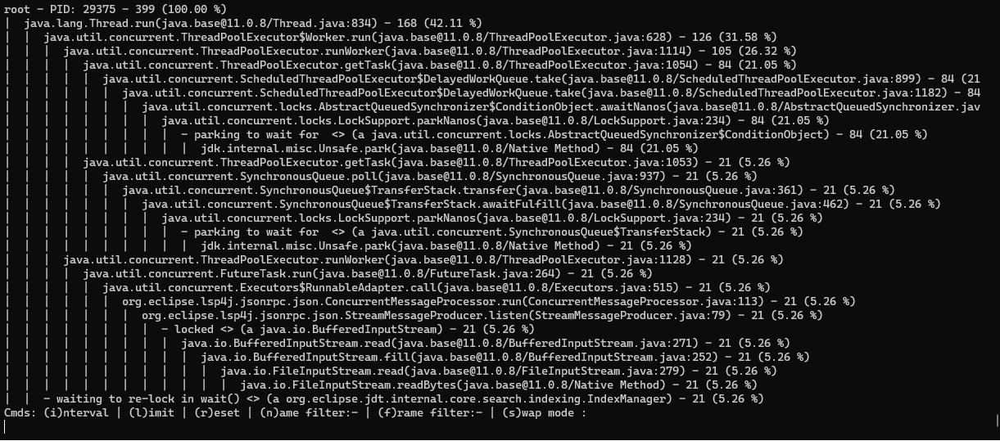
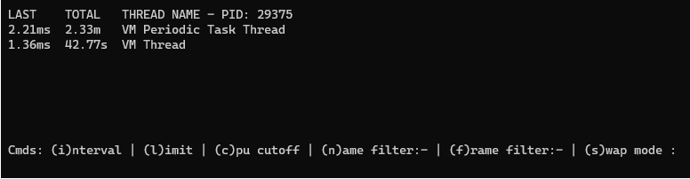

# Description

**Only Tested with jdk-11 on x86-Linux java**

**Assumes jstack is on your path (see [Gotchas](#Gotchas))**

Using the 'jstack' program, provides the following monitoring tools:
- Top thread CPU usage
- Most utilized code via common frame occurrence (see [example](#Stack\ mode\ example) below)

# Basic usage:

Starts jtop in top cpu mode and monitors the jvm at the specified pid

`java -jar jtop.jar <pid>`

Starts jtop, looks for active JVMs, and prompts for which one you want to monitor (starts in cpu mode):

`java -jar jtop.jar`

Prints jtop usage statement:

`java -jar jtop.jar -h`

## Important usage details

jtop takes a sample every **5 seconds** by default, change this with the `-i` flag.

**Scroll** around the output using your **arrow keys**

Exit jtop with: `Ctrl+C`

# Stack mode example

Provides an estimate of the most commonly run code.
For example, if you run jstack 10 times and in every thread, `MyClass.method` is present, you can assume `MyClass.method` is expensive

In the below unfiltered stack example, 399 threads samples were collected:

This frame occurred in 168 stacks with an estimated cpu usage of 42.11%: `java.lang.Thread.run(java.base@11.0.8/Thread.java:834)`

Each subsequent frame is 'called' from the previous.

On *line 3*:

`java.util.concurrent.ThreadPoolExecutor$Worker.run (java.base@11.0.8/ThreadPoolExecutor.java:628) - 126` 

is called by: 

`java.lang.Thread.run(java.base@11.0.8/Thread.java:834) - 168`
 

## Other nodes about stack mode:

Each percentage is that frame's occurrence within that stack / the total root samples.

**Note: if you have a frame filter applied, stack mode will remove all frames prior to the filter.**

**By default the children of frames with less than 5% occurrences will be omitted from output, change this with the `limit` command or `-l` flag**

# Top CPU mode example

Relatively self explanatory. In this example, `VM Periodic Task Thread` used 2.21 milliseconds of cpu time during the last sample interval and has used 2.33 minutes of cpu time for the lifetime of the JVM.

# Gotchas

jtop is parsing jstack output, so if your jstack is slightly different than what I coded against, it will not work. Future work should incorporate these nuances.

jtop assumes jstack is on your path, if it is not, you can tell jtop where it is like so:

`java -Djstack=/path/to/java/bin/jstack -jar jtop.jar`

When you change a filter/interval, you will have to wait for the current interval to expire before the display will update.

I like putting `java -jar jtop.jar my-defaults-args` in a script called 'jtop' that I put on my path.

# To Build:

`mvn clean install`